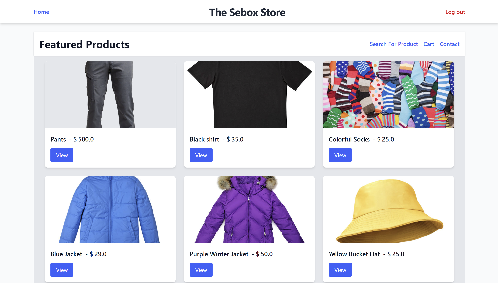
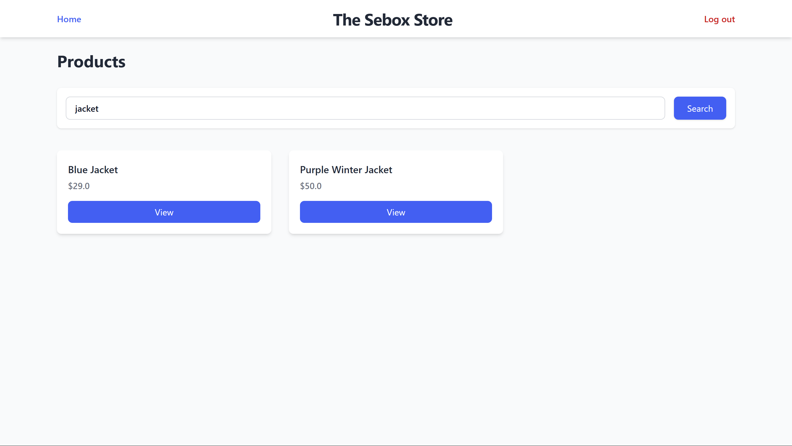
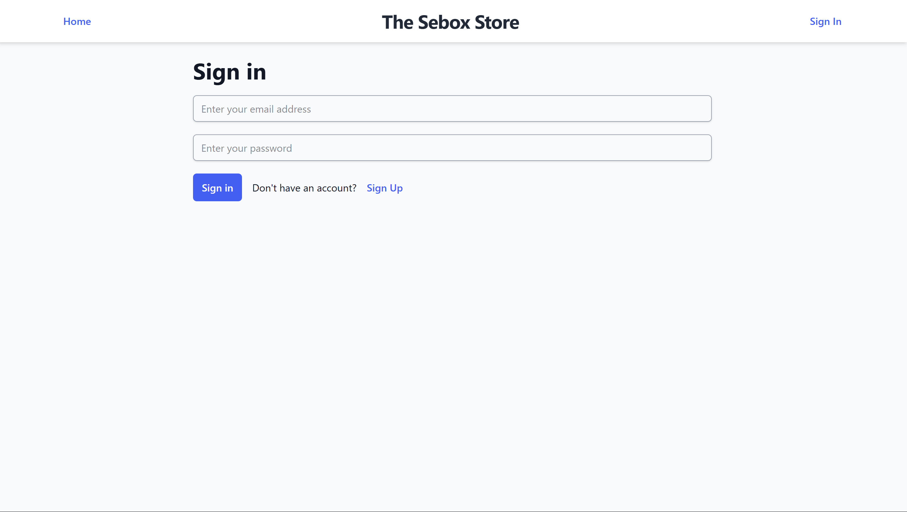
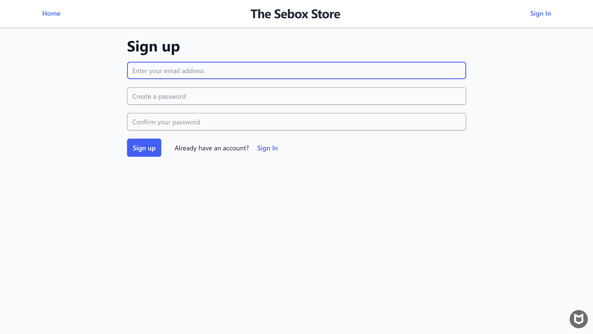
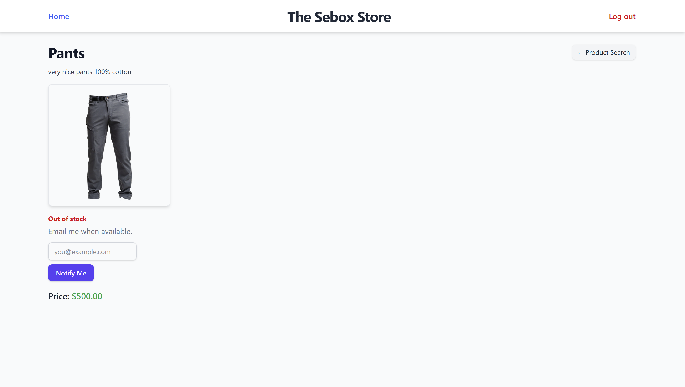
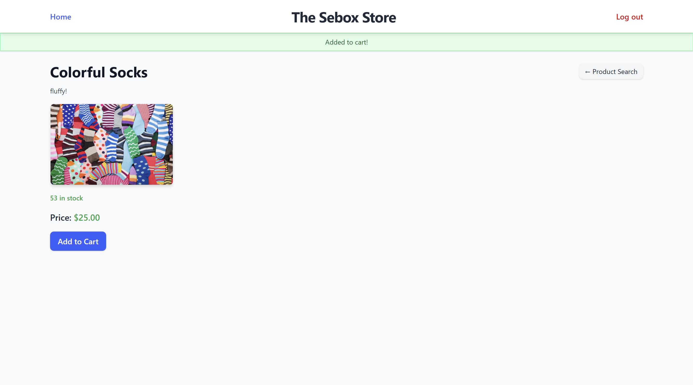
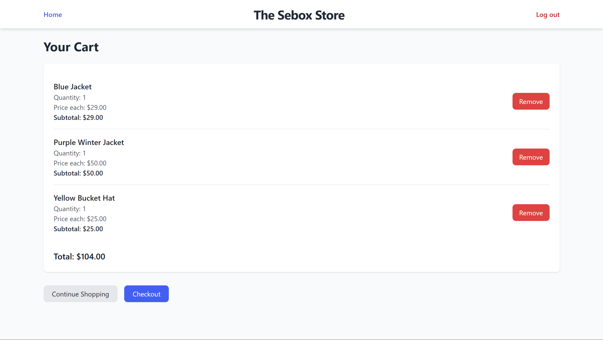
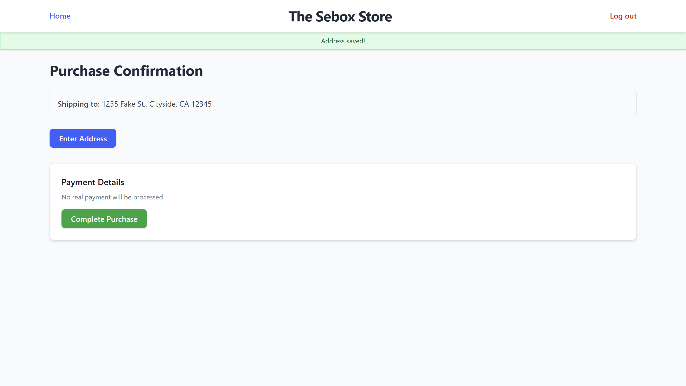
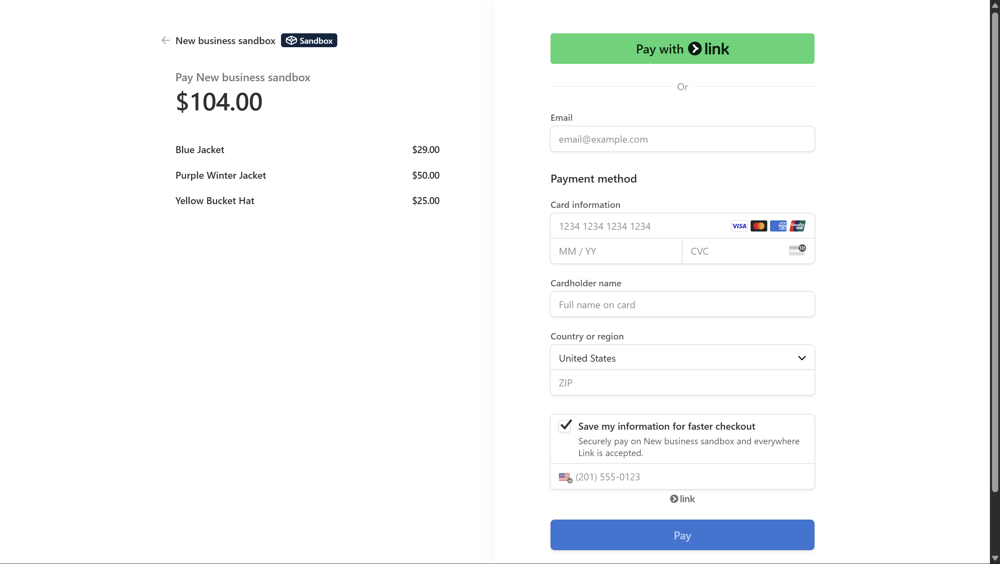
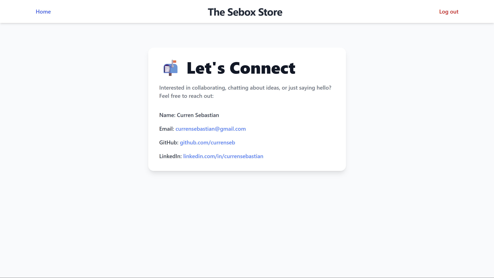

# 🛒 Sebox E-Commerce Store

Sebox is a full-stack e-commerce web application built with Ruby on Rails and styled using Tailwind CSS. It supports essential online shopping features like user authentication, product browsing, cart management, and a secure checkout process using Stripe.

---

## 📸 Screenshots Walkthrough

### 1. 🏠 Homepage


The homepage displays featured products. Users can quickly browse and click into product detail pages.

---

### 2. 🔍 Product Search



Users can search for products by name. Results dynamically update based on search queries.

---

### 3. 🔐 User Authentication



Users must sign in or register to start shopping. Authentication is required to add items to the cart or proceed to checkout. The app supports password hashing and secure login sessions.

---

### 4. 🚫 Out of Stock


If a product is out of stock, users are informed and prevented from adding it to their cart. Users also have the option to opt into an email mailer to notify them when the item is back in stock.

---

### 5. 🛍️ Product Detail & Add to Cart


Each product detail page shows images, descriptions, price, and available inventory. Logged-in users can add items to their cart directly from this page.

---

### 6. 🛒 Cart View


The cart page lists all items added, including quantities and subtotal pricing. Users can remove items, proceed to checkout, or continue shopping.

---

### 7. 📦 Checkout Process

#### Step 1: No Saved Address


If no shipping address is on file, the user is prompted to enter one.

#### Step 2: Enter Address


Users fill out their shipping details.

#### Step 3: Saved Address


The address is then saved in the database and can be reused for future orders.

---

### 8. 💳 Stripe Payment


Checkout is powered by Stripe for secure and real-time payments (not real in this case).

---

### 9. 🔗 Connect Page


The connect page offers information about me and ways to contact or stay updated.

---

## 🚀 Tech Stack

- **Backend:** Ruby on Rails
- **Frontend:** Tailwind CSS, ERB templates
- **Auth:** Secure login system using Rails’ built-in user authentication
- **Payments:** Stripe integration
- **Database:** SQLite3

---

## 📁 Folder Structure

This app follows the standard Rails layout with a few extras:

- `app/` contains your core logic: models, views, and controllers.
- `config/routes.rb` defines how URLs map to controller actions.
- `screenshots/` holds all screenshots used for documentation.
- `.kamal/`, `.vercel/` are used for deployment configuration.
- `public/` serves static assets like the favicon.
- `.env` is where environment variables like Stripe keys are stored (not visible on GitHub).

---

## 🧪 Future Improvements

- Live deloyment
- CI/CD GitHub Actions
- Activity tracking (product views or conversions)

---

## 🙌 Run the Server Yourself

To run the project locally (must have rails installed):

```bash
bundle install
rails db:create db:migrate
rails server
